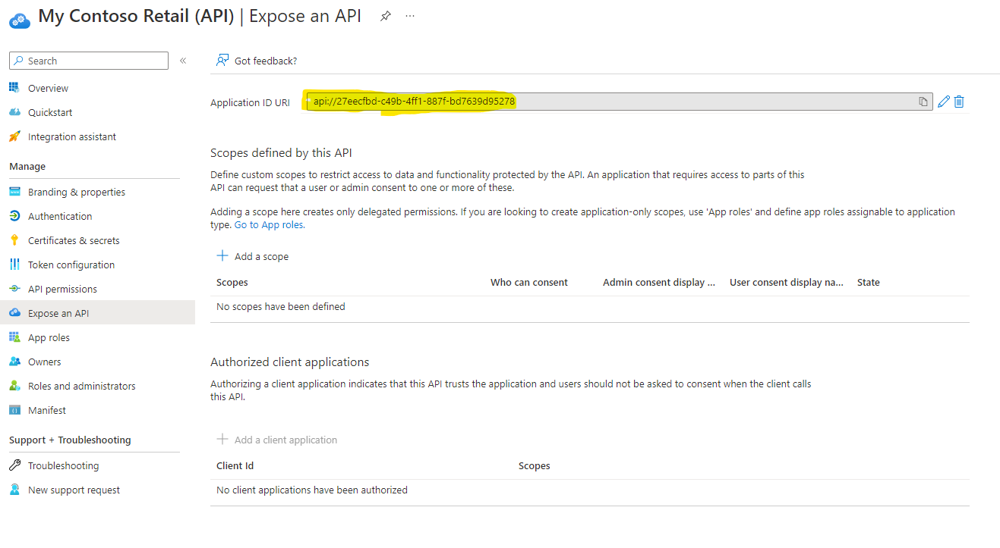
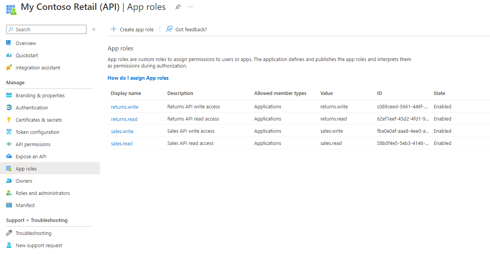
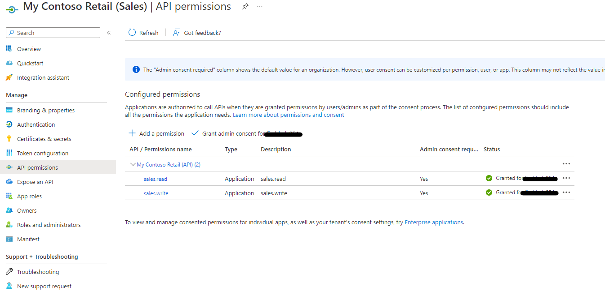
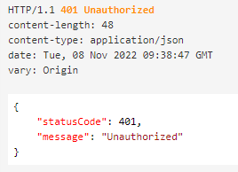

# Overview

This is an example on how to setup AAD for authentication and authorization of API's in API Management.

It's using Roles to drive the authorization of the API call's to allow more granular control of an API estate.

It will be creating 3x AAD Application Registrations:
- 1x API  Application
- 2x Client Applications 

Once created to protect the API's in API Management using the API Application and Roles.

There's a script that can be run to setup the application registrations in ADD 


## Prerequisites  

- Azure Tenant with Global Admin access
- Azure Subscription with owner access
- VS Code / Git
- Instance of API Management for use


## STEP 1 - Setup AAD Application Registrations

### Run the following script: ``` ./API-App-Registration.azcli ```

This creates 3x Application Registrations for securing the API's with AAD. Multiple client applications can be created that are linking to the API application.    

Below shows some of the key areas that have been configured in the application registrations created by the script:

### API Application Registration - My Contoso Retail (API)

The two key areas that get setup are shown below. 

The application ID URI is used for the audience when setting up the policy later in API Management.  It can be any value, but in this example the Application ID is being used.

    
This is where the roles are created that will be aligned to the API's. In this case it has 2 groups of roles relating to Sales and Returns with read and write options:  

    sales.read, sales.write, returns.read, returns.write

These get used when seting up the policy later in API Management


### Client Application/s Registration - My Contoso Retail (Sales or Returns)

This is the identity that will be calling the API's. It will have permissions linked the the roles that it will have access to from the API application above. 

So for a client that has access to the sales API's it will have permissions to the sales roles (e.g. sales.read and/or sales.write)

This can be seen below:




## STEP 2 - Add API Application policy update

In the API Management inboard policy. Add the following per API.

You'll need the following:

- Tenant ID where the applciation registrations were create
- Application ID URI (Audience) e.g. api://\<clientid\>
- Role/s for that API to accept.


``` 
<validate-jwt header-name="Authorization" failed-validation-httpcode="401" failed-validation-error-message="Unauthorized" require-expiration-time="true" require-scheme="Bearer" require-signed-tokens="true">
    <openid-config url="https://login.microsoftonline.com/<TenantId>/.well-known/openid-configuration" />
    <required-claims>
        <claim name="aud" match="all">
            <value><api://<ClientId>></value>
        </claim>
        <claim name="roles" match="all">
            <value>returns.write</value>
        </claim>
    </required-claims>
</validate-jwt>
```

## STEP 3 - Generate client secret

To be able to call the API. A client secret is required. To generate the secret go to the client application registration in AAD and create a secret.

Remember to copy it and save it in a safe place. As you can't see it again once you leave the screen.

Below shows where this is:


## STEP 4 - Get Bearer Token

Now that the API is setup. To be able to call an API a bearer token is required. Below shows how to generate a token to pass to the API request:

### Post to URL

    https://login.microsoftonline.com/<tenantId>/oauth2/v2.0/token

Replace:
- TenantId with a tenant where the application registration were created 
- client Id with the client id for the application registration that will be calling the API.
- client secret with the secret created in step 3

### Body (form-data) 
| Key  | Value  | Note|
|---|---|---|
| grant_type | client_credentials  |   |  
|  client_id | \<Application Registration client Id\>   |   |  
| client_secret  | \<Application Registration client Secret\>   |   
| scope  |  api://\<Application Registration client Id\>/.default |   
| redirect_uri  |   |   

Example: 


Test the token by pasting the **access_token** into https://jwt.io  

Should be able to see the Roles assigned in the token (e.g. sales.read, sales.write)

This **access_token** will be used in STEP 5 below when called the API.


## STEP 4 - Call API

When calling the API the following needs to be included in the headers the following:

| Header | Value | Note |
| --- | --- | --- |
| Authorization | Bearer \<access_token\> |  |
| Ocp-Apim-Subscription-Key | \<API Key\> |  |
|  |   


If the token isn't validate the API will return an unauthorized response:  




If it is valid API Management will call the backend API and return a response:  


